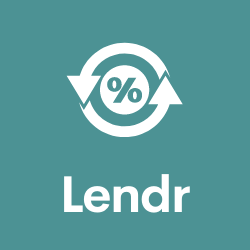

<div id="top"></div>
<br />
<div align="center">



<h3 align="center">A world of devices at your door step</h3>

  <p align="center">
    Lendr lets you find household items locally and sustainably. Why spend money on new products when someone nearby might have all you need to complete the job. Be conscious - reuse & reduce.
    <br />
    <a href="https://github.com/aniltarar/lendr"><strong>View the Project</strong></a>
  </p>
</div>

<details>
  <summary>Table of Contents</summary>
  <ol>
    <li>
      <a href="#about-the-project">About The Project</a>
      <ul>
        <li><a href="#built-with">Built With</a></li>
      </ul>
    </li>
    <li>
      <a href="#getting-started">Getting Started</a>
      <ul>
        <li><a href="#prerequisites">Prerequisites</a></li>
        <li><a href="#installation">Installation</a></li>
      </ul>
    </li>
    <li><a href="#usage">Usage</a></li>
    <li><a href="#roadmap">Roadmap</a></li>
    <li><a href="#contributing">Contributing</a></li>
    <li><a href="#license">License</a></li>
    <li><a href="#contact">Contact</a></li>
    <li><a href="#acknowledgments">Acknowledgments</a></li>
  </ol>
</details>


<!-- ABOUT THE PROJECT -->
## About The Project

<a href="https://www.figma.com/file/Fe3t1ERs92GeCxssqmEZF1/Lendr?node-id=6%3A482"><strong>Figma Design</strong></a>

<a href="https://trello.com/b/axePQPg6/lendr"><strong>Trello Board</strong></a>


This project is designed to allow users to rent local household items that they may not have on hand at home in order to minimise waste. We want to create a single page application that allows users to add and delete products and view products locally using their location.

Users can signup/login/logout securely and will only be able to add and delete products with an account. They should be able to leave reviews for other users and search products via category, price and availability.

New products should be featured on the homepage with price/hr and the user hosting them, along with their current review.

<p align="right">(<a href="#top">back to top</a>)</p>


### Built With

* [Express.js](https://expressjs.com/)
* [Bootstrap](https://getbootstrap.com)

<p align="right">(<a href="#top">back to top</a>)</p>


<!-- GETTING STARTED -->
## Getting Started

How to get started using Lendr:

### Prerequisites

* npm
  ```sh
  npm install npm@latest -g
  ```

### Installation

1. Get two google API Keys for geocoding and places at [Google Maps Api](https://developers.google.com/maps/documentation/javascript/get-api-key)
2. Clone the repo
   ```sh
   git clone https://github.com/aniltarar/lendr
   ```
3. Install NPM packages
   ```sh
   npm install
   ```

4. Create a local database called lendr
   ```sh
   createdb lendr
   ```

5. Create a local database called lendr
   ```sh
   createdb lendr
   ```

6. Enter your APIs and keys in `.env` file
   ```js
   EXPRESS_SESSION_SECRET_KEY='ENTER SESSION KEY';
   DB_PASSWORD='DB_PASSWORD';
   DB_USERNAME='DB_USERNAME';
   GOOGLE_API_KEY = 'ENTER YOUR API';
   GEOCODING_API_KEY = 'ENTER YOUR API';
   ```

<p align="right">(<a href="#top">back to top</a>)</p>


<!-- USAGE EXAMPLES -->
## Usage

_For more examples, please refer to the [Documentation](https://example.com)_

<p align="right">(<a href="#top">back to top</a>)</p>


<!-- ROADMAP -->
## Roadmap

Need to have:

- CRUD operations for products
- Signup/Login/Logout
    - Sessions
    - Bcrypt passwords   
- Find local products
    - Use location API
    - Find item based on availability, price & category
- User Interface
    - Leave reviews

Nice to have:

- UI
    - Calendar selection  
- User interface
    - Message other users


<p align="right">(<a href="#top">back to top</a>)</p>


<!-- CONTRIBUTING -->
## Contributing

Contributions are what make the open source community such an amazing place to learn, inspire, and create. Any contributions you make are **greatly appreciated**.

If you have a suggestion that would make this better, please fork the repo and create a pull request. You can also simply open an issue with the tag "enhancement".
Don't forget to give the project a star! Thanks again!

1. Fork the Project
2. Create your Feature Branch (`git checkout -b feature/AmazingFeature`)
3. Commit your Changes (`git commit -m 'Add some AmazingFeature'`)
4. Push to the Branch (`git push origin feature/AmazingFeature`)
5. Open a Pull Request

<p align="right">(<a href="#top">back to top</a>)</p>


<!-- LICENSE -->
## License

Distributed under the MIT License. See `LICENSE.txt` for more information.

<p align="right">(<a href="#top">back to top</a>)</p>


<!-- CONTACT -->
## Contact

Xiomara Masmela, Anil Tara & Lucy Kendall

Project Link: [https://github.com/aniltarar/lendr](https://github.com/aniltarar/lendr)

<p align="right">(<a href="#top">back to top</a>)</p>


<!-- ACKNOWLEDGMENTS -->
## Acknowledgments

* []()
* []()
* []()

<p align="right">(<a href="#top">back to top</a>)</p>
